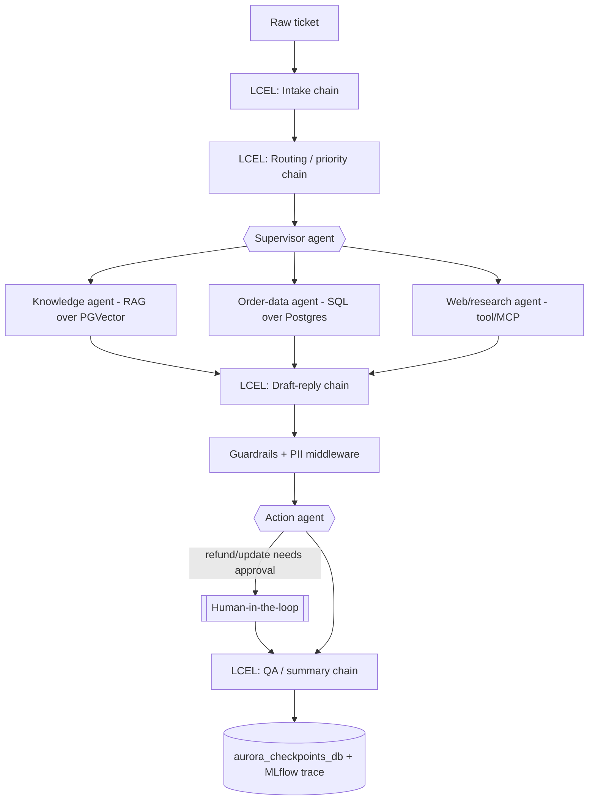

# Capstone Project — "Aurora": AI Customer Support Operations Center

An end-to-end capstone that ties together **everything from wk1–wk4**: LCEL chains, RAG over a
vector store, tool-using agents, multi-agent coordination, MCP, middleware (guardrails / HITL /
retries), persistence, and MLflow tracing — built on a **Postgres database with the `pgvector`
extension** for both the relational and vector-store needs.

---

## The scenario

An online store receives customer tickets (email/chat). **Aurora** triages each ticket, researches
it against internal knowledge and live order data, drafts a brand-voice reply, and takes actions
(refunds, order updates) — with **human approval for risky actions** and **guardrails** on everything.

The system deliberately mixes two styles:

- **LCEL chains** for *deterministic* steps (normalize, classify, draft, summarize).
- **Agents** for *open-ended, tool-using* reasoning (knowledge lookup, SQL, web, actions).

---

## Architecture



---

## Data & infrastructure (Postgres only)

Two **brand-new, dedicated databases** are created for this project (kept separate so you can see
each concern clearly). Everything is provisioned from `aurora_common.py`:

| Database | Purpose | Contents |
| --- | --- | --- |
| **`aurora_db`** | relational + vector | `customers`, `products`, `orders`, `order_items` tables **and** the `aurora_help_center` PGVector collection |
| **`aurora_checkpoints_db`** | agent state | LangGraph/agent checkpoints (one thread per ticket) |

`aurora_common.py` provides:

- `create_project_databases()` — provisions both DBs (pgvector enabled on `aurora_db`).
- `seed_orders_db(reset=)` / `get_orders_sqldatabase()` / `get_engine()` — relational store.
- `seed_knowledge_base(reset=)` / `get_knowledge_retriever(k=)` — help-center RAG over PGVector.
- `create_pg_checkpointer()` — Postgres checkpointer in the isolated checkpoints DB.
- `make_thread_config(ticket_id=)`, `enable_mlflow_tracing()`.
- Ready-to-use `llm`, `llm_noreason`, `embeddings`.

Every notebook starts with one line:

```python
%run aurora_common.py
```

---

## The pieces to build

### LCEL chains (deterministic)
| Chain | Input → Output |
| --- | --- |
| Intake / normalize | raw text → structured ticket (`customer_id`, `order_id`, intent, sentiment) |
| Routing / priority | ticket → category + priority + which agent to call |
| Draft reply | research + policy → brand-voice customer reply |
| QA / summary | resolution → CRM summary + tone check |

### Agents (tool-using)
| Agent | Tools |
| --- | --- |
| Supervisor | the sub-agents, wrapped as tools |
| Knowledge (RAG) | `get_knowledge_retriever()` over PGVector |
| Order-data (SQL) | SQL over the four Postgres tables |
| Web / research | carrier/shipping lookup (simple tool, or wire the wk4.2 MCP web tool) |
| Action | `issue_refund`, `update_order`, `send_email` (guarded) |

### Cross-cutting middleware & infra
PII redaction · human-in-the-loop approval for refunds · guardrails (block off-topic / leaks) ·
retries + model fallback · summarization / context editing · Postgres checkpointer · MLflow tracing.

---

## Notebook sequence

| # | Notebook | Focus |
| --- | --- | --- |
| 0 | `0.setup_and_data.ipynb` | Provision both databases; seed relational + vector data; sanity checks |
| 1 | `1.lcel_intake_routing.ipynb` | Intake + routing LCEL chains (structured output) |
| 2 | `2.agents_knowledge_order_web.ipynb` | The RAG, SQL, and web sub-agents |
| 3 | `3.supervisor.ipynb` | Multi-agent coordinator (agents-as-tools) |
| 4 | `4.draft_qa_chains.ipynb` | Draft-reply + QA/summary LCEL chains |
| 5 | `5.guardrails_pii_hitl.ipynb` | Wrap the action agent: PII, guardrails, human approval |
| 6 | `6.resilience_persistence.ipynb` | Retries/fallback + per-ticket Postgres checkpointing |
| 7 | `7.observability_end_to_end.ipynb` | Full pipeline run with MLflow tracing (capstone integration) |

Each notebook `1`–`7` is a **guided stub**: working setup plus clearly marked `TODO` exercises and a
"Definition of done." Notebook `0` runs fully as-is.

---

## Extension ideas (optional practice)
Multi-language replies (dynamic prompt) · escalation to a "manager" agent · a small eval harness
scoring reply quality · feedback loop that re-indexes resolved tickets into the knowledge base ·
swap the web tool for the real wk4.2 MCP server · a Streamlit "agent inbox" for approvals.

---

## Concepts reused from earlier weeks

- **wk1:** MLflow tracing.
- **wk2:** LCEL chains, embeddings, RAG, chunking — now over **PGVector**.
- **wk3:** agents, tools, memory/checkpointers, streaming, structured (Pydantic) tools.
- **wk4:** multi-agent coordination, MCP tools, and all the middleware (message management, HITL,
  guardrails, dynamic prompts, retries/fallback, tool selection, context editing).
